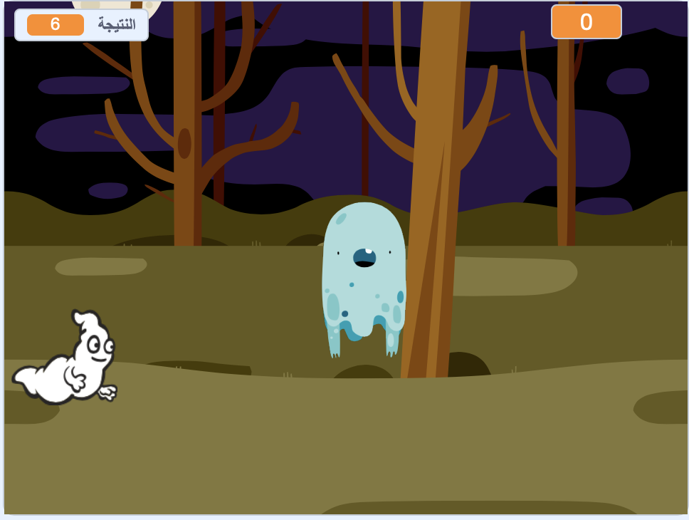

\--- no-print \---

هذا هو إصدار ** Scratch 3 ** من المشروع. هناك أيضًا [ إصدار Scratch 2 للمشروع ](https://projects.raspberrypi.org/en/projects/ghostbusters-scratch2).

\--- /no-print \---

## المقدمة

سوف تقوم بصنع لعبة إصطياد أشباح!

\--- no-print \---

  <iframe allowtransparency="true" width="485" height="402" src="https://scratch.mit.edu/projects/embed/276874679/?autostart=false" frameborder="0" scrolling="no"></iframe>
  

\--- /no-print \---

\--- print-only \---

\--- /print-only \---

## \--- collapse \---

## title: ما ستحتاج إليه

### الأجهزة

- جهاز حاسب آلي

### البرمجيات

- برنامج Scratch 3 (سواء أكان [عبر الإنترنت](http://rpf.io/scratchon){:target="_blank"} أو [دون اتصال بالإنترنت](http://rpf.io/scratchoff){:target="_blank"})

\--- /collapse \---

## \--- collapse \---

## title: ما الذي ستتعلمه

- فهم الحاجة الى التوقفات بين الاجراءات داخل الحلقات التكرارية
- استخدام التعليمات البرمجية لإنشاء أرقام عشوائية في برنامج Scratch
- إضافة متغير لخزن نتيجة اللعبة في Scratch

\--- /collapse \---

## \--- collapse \---

## title: ملاحظات إضافية للمعلمين

\--- no-print \---

إذا كنت بحاجة إلى طباعة هذا المشروع، فالرجاء استخدام [نسخة متوافقة مع الطابعة](https://projects.raspberrypi.org/en/projects/ghostbusters/print){:target="_blank"}.

\--- /no-print \---

يمكنك الحصول على [المشروع كاملاً من هنا](http://rpf.io/p/en/ghostbusters-get){:target="_blank"}.

\--- /collapse \---