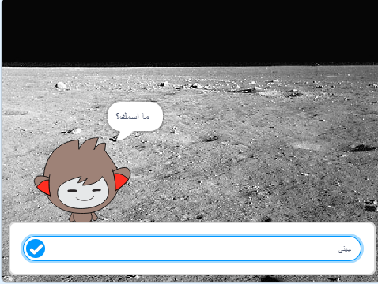

## ما التالي؟

احسنت صنعاً باكمالك لمشروع صائد الاشباح! هل ترغب في انشاء شيء ما اكثر تحدياً؟

جرّب مشروع [روبوت الدردشة](https://projects.raspberrypi.org/en/projects/chatbot?utm_source=pathway&utm_medium=whatnext&utm_campaign=projects).

\--- no-print \---

انقر على العلم الاخضر، ثم انقر على شخصية روبوت الدردشة لبدء المحادثة. عندما يسألك روبوت المحادثة سؤالاً، اكتب اجابتك في المربع الموجود اسفل المنصة، ثم انقر على العلامة الزرقاء في اليمين (او اضغط `Enter`) لترى جواب الروبوت.

  <iframe allowtransparency="true" width="485" height="402" src="https://scratch.mit.edu/projects/embed/248864190/?autostart=false" 
  frameborder="0" scrolling="no"></iframe>

\--- /no-print \---

\--- print-only \---

\--- /print-only \---