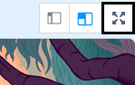

## إضافة نتيجة

والان ستقوم باضافة تعليمات برمجية الى لعبتك حتى يتمكن اللاعب من اصطياد الاشباح!

--- task ---

هل تستطيع أن تجعل الشبح يختفي اذا تم اصطياده؟ يجب على اللاعب أن يكون قادراً على النقر على الاشباح ليصطادها.

اذا قمت باختبار اللعبة خاصتك ووجدت أن اصطياد الاشباح صعباً، يمكنك أن تلعب اللعبة في وضع الشاشة الكاملة بالنقر فوق هذا الزر:



--- hints ---
 --- hint ---

`عند نقر الكائن`{:class="block3events"} يجب على كائن الشبح ان `يختفي`{:class="block3looks"}.

--- /hint --- --- hint ---

يجب أن تبدو التعليمات البرمجية خاصتك بالشكل التالي:


```blocks3
عند نقر هذا الكائن
اختف
```

--- /hint ------ /hints ---

--- /task ---