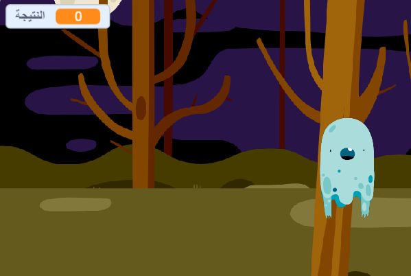

## إضافة نقطة

لنجعل اللعبة أكثر تشويقًا بتسجيل النقاط!

+ أنشئ متغيرًا جديدًا يُسمى 'النقاط'.

[[[generic-scratch-add-variable]]]

+ هل يمكنك تسجيل نقاط اللاعب؟ يجب أن يتمكن اللاعبون من إحراز النقاط بالنقر فوق الأشباح واصطيادها.

     يجب أن يزيد عدد نقاط اللاعب في كل مرة ينقر فيها على شبح.

    

--- hints ---
--- hint ---
`عند النقر فوق العلم الأخضر`، يجب أن يكون المتغير `النقاط` مبرمجًا على `عيِّن إلى 0`. والمنصة هي أفضل مكان لإضافة هذه التعليمة البرمجية. `عند النقر فوق كائن الشبح`، يجب أن يتغيَّر المتغير `النقاط` بمقدار نقطة واحدة باستخدام `غيِّر بمقدار 1`.
--- /hint ---
--- hint ---
فيما يلي هذه قوالب التعليمات البرمجية التي ستحتاج إلى استخدامها:

--- /hint ---
--- hint ---
إليك التعليمات البرمجية لكيفية تسجيل النقاط عند النقر فوق الأشباح:

--- /hint ---
--- /hints ---
