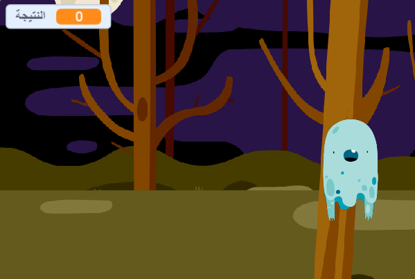

## التحدي: كائنات أخرى

والان سنجعل من لعبتك أكثر تشويقاً بتسجيل نقاط!

\--- task \---

إنشاء متغير جديد يدعى`نتيجة` {:class="block3variables"}.

[[[generic-scratch3-add-variable]]]

\---/task--

\--- task \---

هل تستطيع تتبع نقاط الاعب؟ يجب أن يتمكن اللاعبين من إحراز النقاط عند النقر فوق الاشباح لاصطيادها.

في كل مرة ينقر فيها اللاعب على الشبح، يجب ان تزيد عدد النقاط.



\--- hints \--- \--- hint \---

`عند نقر العلم الاخضر`{:class="block3events"} فإن متغير `نتيجة`{:class="block3variables"} يجب أن `يساوي 0`{:class="block3variables"}. المنصة هي أفضل مكان لإضافة هذه التعليمة البرمجية.

`عند نقر كائن الشبح`{:class="block3events"} فان متغير `نتيجة`{:class="block3variables"} يجب أن `تتغير بمقدار 1`{:class="block3variables"}.

\--- /hint \--- \--- hint \---

هنا التعليمات البرمجية التي ستحتاج اليها:


```blocks3
اجعل [نتيجة v] مساوياً (0)

عند نقر العلم
```


```blocks3
غيِّر [score v] بمقدار (1)
```

\--- /hint \--- \--- hint \---


```blocks3
عند نقر العلم
اجعل [نتيجة v] مساوياً (0)
```


```blocks3
عند نقر هذا الكائن
اختف

+غيّر [نتيجة v] بمقدار (1)
```

\--- /hint \--- \--- /hints \---

\---/task\---