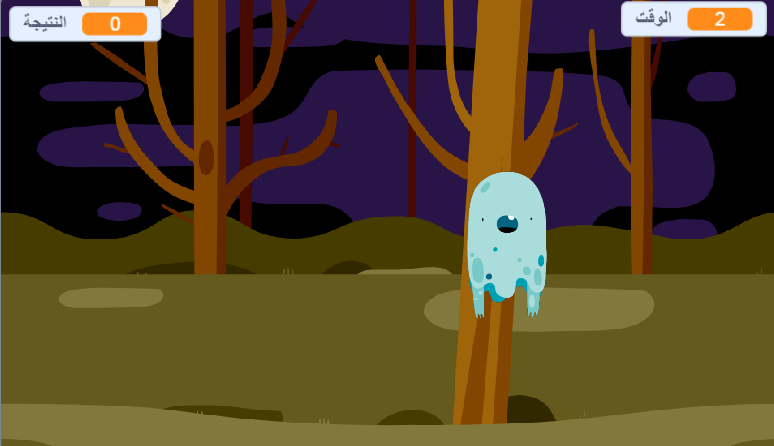

  [مشروع مكتمل دون اتصال بالإنترنت](resources/Ghostbusters-Finished.sb2){:download='Ghostbusters-Finished.sb2'} [مشروع مكتمل عبر الإنترنت](http://scratch.mit.edu/projects/60787262/#editor){:target="_blank"}

\--- challenge \---

## التحدي: "كائنات أخرى"

هل يمكنك إضافة كائنات أخرى إلى اللعبة؟

عندما تضيف كائنًا، يجب أن تفكِّر في الآتي.

+ ما حجمه؟
+ هل ستكون مرّات ظهوره أكثر من مرّات ظهور الأشباح أم أقل؟
+ كيف سيكون مظهره / صوته إذا تم اصطياده؟
+ كم عدد النقاط التي سيحرزها اللاعب (أو يخسرها) عندما يحاول اصطياده؟

إذا كنتَ تحتاج إلى مساعدة عند إضافة كائن آخر، فيمكنك استخدام الخطوات أعلاه!

\--- /challenge \---