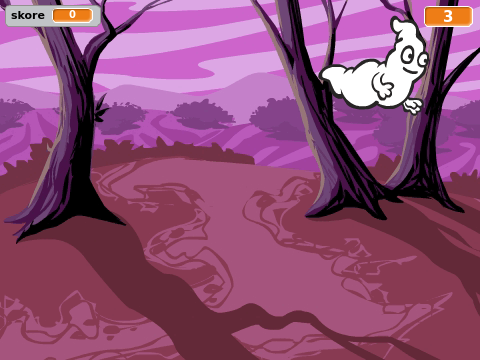

## Úvod

Pojďme udělat hru o chytání duchů!

### What you will make

\--- no-print \---

\--- /no-print \---

\--- print-only \---

\--- /print-only \---

\--- collapse \---

* * *

## title: What you will need

### Hardware

+ A computer

### Software

+ Scratch 2.0 (either [online](http://rpf.io/scratchon){:target="_blank"} or [offline](http://rpf.io/scratchoff){:target="_blank"})

\--- /collapse \---

\--- collapse \---

* * *

## title: What you will learn

This project covers elements from the following strands of the [Raspberry Pi Digital Making Curriculum](http://rpf.io/curriculum){:target="_blank"}:

+ [<0>Použij základní programovací konstrukce k vytvoření jednoduchých programů</0>{:target="_blank"}.](https://www.raspberrypi.org/curriculum/programming/creator)

\--- /collapse \---

\--- no-print \---

If you need to print this project, please use the [Printer friendly version](https://projects.raspberrypi.org/en/projects/ghostbusters/print).

\--- /no-print \---