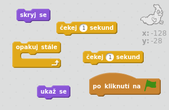
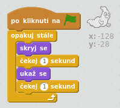

## Animace ducha

\--- task \---

Otevři nový Scratch projekt.

[[[generic-scratch-new-project]]]

\--- /task \---

\--- task \---

Přidej novou postavu duch a vhodnou kulisu scény.

[[[generic-scratch-sprite-from-library]]]

[[[generic-scratch-backdrop-from-library]]]

\--- /task \---

\--- task \---

Přidej duchovi takový kód, aby po kliknití na zelený praporek začal mizet a znovu se objevovat a aby to dělal stále.

\--- hints \--- \--- hint \--- `Po kliknutí na zelený praporek`{:class=”blockevents”}, musíš svého ducha `sskrýt`{:class=”blocklooks”} na `jednu vteřinu`{:class=”blockcontrol”} a poté ho znovu na `jednu vteřinu`{:class=”blockcontrol”} `ukázat`{:class=”blocklooks”}. To by jsi měl `opakovat stále`{:class=”blockcontrol”}. \--- /hint \--- \--- hint \--- Zde jsou bloky, které budeš potřebovat:  \--- /hint \--- \--- hint \--- Takto by měl vypadat tvůj kód:  \--- /hint \--- \--- /hints \---

\--- /task \---

\--- task \---

Otestuj a ulož svůj projekt.

[[[generic-scratch-saving]]]

\--- /task \---