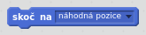
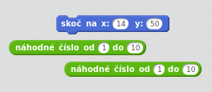
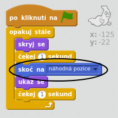
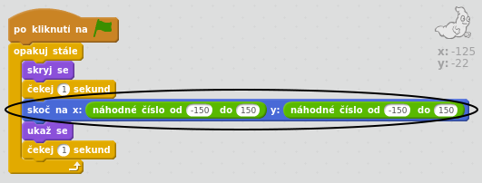

## Náhodní duchové

Tvého ducha je v tuto chvíli opravdu snadné chytit, nehýbe se!

\--- task \---

Dokážeš přidat kód do svého ducha tak, aby se náhodně objevoval na různým místech na obrazovce, místo toho, aby zůstával stále na stejné pozici?

\--- hints \--- \--- hint \--- Potřebuješ, aby tvůj duch provedl `skoč na`{:class=”blockmotion”} náhodnou pozici na scéně pokaždé, než se objeví. \--- /hint \--- \--- hint \--- Můžeš použít dvě sady bloků kódu. Tento:  nebo tento:  \--- /hint \--- \--- hint \--- Tvůj kód může vypadat takto:  Nebo pro změnu takto:  \--- /hint \--- \--- /hints \---

\--- /task \---

\--- challenge \---

## Výzva: více náhodnosti

Dokážeš svého ducha přimět `čekat` {: class="blockcontrol"} po náhodně dlouhou dobu předtím, než se znovu objeví? Dokážeš využít blok `nastav velikost na`{:class="blocklooks"} tak, aby tvůj duch změnil náhodně velikost pokaždé, když se znovu objeví? \--- /challenge \---