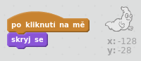

## Chytání duchů

Pojďme zařídit, aby hráč mohl ducha chytat!

\--- task \---

Dokážeš, aby tvůj duch zmizel, kdykoliv je uloven?

Měl bys být schopen chytit ducha kliknutím na něj. Pokud zjistíš, že je chytání obtížné, můžeš hru hrát v režimu celé obrazovky. Přepneš do něj kliknutím na toto tlačítko:

\--- hints \--- \--- hint \--- `Po kliknutí`{:class=”blockevents”}, by se měla postava ducha `skrýt`{:class=”blocklooks”}. \--- /hint \--- \--- hint \--- Tvůj kód by měl vypadat takto:  \--- /hint \--- \--- /hints \---

\--- /task \---

\--- challenge \---

## Výzva: přidání zvuku

Dokážeš zařídit, aby duch udělal zvuk, kdykoliv je chycen? \--- /challenge \---