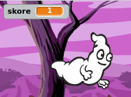
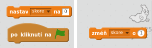
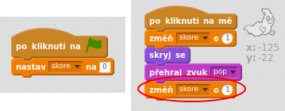

## Přidání skóre

Pojďme udělat věci zajímavější tím, že budeme sledovat skóre!

\--- task \---

Vytvoř novou proměnnou nazvanou "skóre".

[[[generic-scratch-add-variable]]]

\--- /task \---

\--- task \---

Dokážeš sledovat skóre hráče? Hráči by měli získávat body chytáním duchů tím, že na ně budou klikat.

Pokaždé, když hráč klikne na ducha, by se jeho skóre mělo zvýšit.

\--- hints \--- \--- hint \--- `Po kliknutí na zelený praporek`{:class=”blockevents”}, proměnnou `skóre`{:class=”blockdata”} inicializujeme `nastavením na 0`{:class=”blockdata”}. Scéna je nejlepším místem pro přidání tohoto kódu. `Po kliknutí na ducha`{:class=”blockevents”}, potřebujeme proměnnou `skóre`{:class=”blockdata”} `změnit o 1`{:class=”blockdata”}. \--- /hint \--- \--- hint \--- Zde jsou bloky, které budeš potřebovat:  \--- /hint \--- \--- hint \--- Zde je způsob, který zvyšuje skóre, když klikneš na ducha:  \--- /hint \--- \--- /hints \---

\--- /task \---