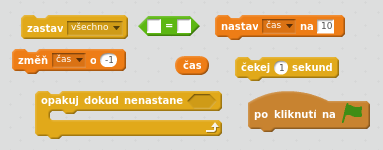
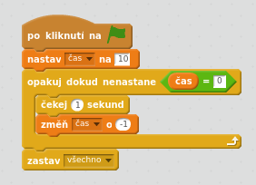
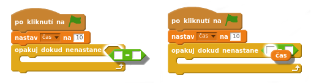

## Přidání časovače

\--- task \---

Vytvoř novou proměnnou nazvanou "čas".

\--- /task \---

\--- task \---

Dokážeš přidat časovač do scény tak, aby hráči měli jen 10 sekund, k chycení co největšího počtu duchů?

Tvůj časovač by měl:

+ Začínat na 10 vteřinách
+ Odpočítávat každou vteřinu

Hra by měla skončit, když se časovač dostane k 0.

\--- hints \--- \--- hint \--- `Po kliknutí na zelený praporek`{:class=”blockevents”}, inicializuj proměnnou `čas`{:class=”blockdata”} `nastavením na 10`{:class=”blockdata”}. Poté `změň čas o -1`{:class=”blockdata”} každou vteřinu `dokud nedosáhne 0`{:class=”blockcontrol"}. \--- /hint \---\--- hint \--- Zde jsou bloky, které budeš potřebovat:  \--- /hint \--- \--- hint \--- Zde je způsob, jak přidat časovač do hry:\--- /hint \--- \--- /hints: 

A takto vytvoříš blok s porovnáním `čas = 0` block:  \--- /hint \--- \--- /hints \---

\--- /task \---

\--- task \---

Požádej kamaráda, aby vyzkoušel tvoji hru. Jaké skóre dokáže získat?

\--- /task \---

Pokud je hra příliš snadná, můžeš:

+ Dát hráči méně času
+ Zařídit, aby se duchové se objevovali méně často
+ Zmenšit duchy

\--- task \---

Několikkrát změň a otestuj svoji hru, dokud nebudeš spokojen/a s úrovní obtížnosti.

\--- /task \---