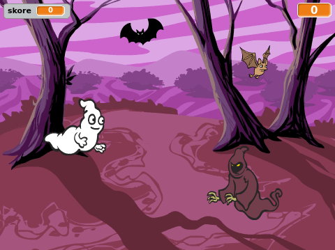

## Výzva: více objektů

Dokážeš přidat do hry další objekty?

Když přidáváš objekt, přemýšlej o následujících věcech.

+ Jak velký bude?
+ Objeví se více či méně často než duch?
+ Jak bude vypadat/znít, když bude chycený?
+ Kolik bodů získá hráč (nebo ztratí) za jeho chycení?

Pokud potřebuješ pomoci s přidáním dalšího objektu, můžeš znovu použít dříve uvedené kroky!