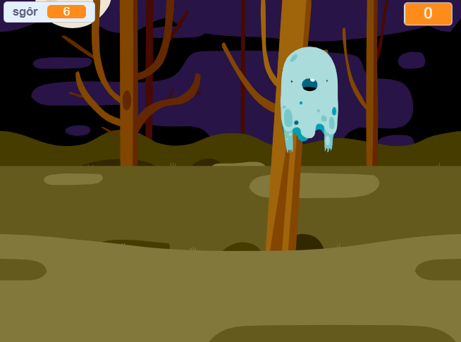

--- no-print ---

Dyma fersiwn **Scratch 3** y prosiect. Ceir hefyd [fersiwn Scratch 2 o'r prosiect](https://projects.raspberrypi.org/cy-GB/projects/ghostbusters-scratch2).

--- /no-print ---

## Cyflwyniad

Rwyt ti mynd i greu gêm i ddal ysbrydion!

--- no-print ---

  <iframe allowtransparency="true" width="485" height="402" src="https://scratch.mit.edu/projects/embed/276874679/?autostart=false" frameborder="0" scrolling="no"></iframe>
  

--- /no-print ---

--- print-only ---

--- /print-only ---

---collapse---
---
title: Beth fydd ei angen arno ti
---

### Caledwedd

- Cyfrifiadur

### Meddalwedd

- Scratch 3 (unai [arlein](http://rpf.io/scratchon){:target="_blank"} neu [all-lein](http://rpf.io/scratchoff){:target="_blank"})

--- /collapse ---

--- collapse ---
---
title: Yr hyn byddi di'n ei ddysgu
---

- Understand the need for pauses between actions within loops
- Use code to generate random numbers in Scratch
- Add a variable to store a game score in Scratch

--- /collapse ---

--- collapse ---
---
title: Gwybodaeth ychwanegol i addysgwyr
---

--- no-print ---

Os oes angen i chi argraffu y prosiect, defnyddiwch [fersiwn i'w argraffu](https://projects.raspberrypi.org/cy-GB/projects/ghostbusters/print){:target="_blank"}.

--- /no-print ---

Gallwch chi ddod o hyd i'r [ateb ar gyfer y prosiect hwn yma](http://rpf.io/p/cy-GB/ghostbusters-get){:target="_blank"}.

--- /collapse ---