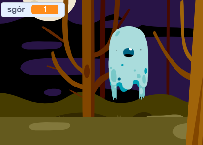

## Ychwanegu sgôr

Rwyt ti am wneud y gêm yn fwy diddorol trwy gadw sgôr!

\--- task \---

Creu newidyn newydd o'r enw `sgôr`{:class="block3variables"}.

[[[generic-scratch3-add-variable]]]

\--- /task \---

\--- task \---

Alli di gadw sgôr y chwareuwr? Fe ddylai chwareuwyr sgorio pwyntio pan maent yn clicio ar ysbryd i'w dal nhw.

Bob tro mae chwareuwr yn clicio ar ysbryd, fe ddylai'r sgôr fynd fyny.



\--- hints \--- \--- hint \---

`Pan fo'r faner werdd wedi ei glicio`{:class="block3events"}, fe ddylai dy newidyn `sgôr`{:class="block3variables"} `fod wedi ei osod i `{:class="block3variables"}. Y Llwyfan yw'r lle gorau i ychwanegu'r côd yma.

`Pan fo'r corlun ysbryd wedi ei glicio`{:class="block3events"}, fe ddylai'r newidyn `sgôr`{:class="block3variables"} `newid gan 1`{:class="block3variables"}.

\--- /hint \--- \--- hint \--- Dyma'r blociau côd rwyt ti eu hangen: 

```blocks3
gosod [sgôr v] i (0)

pan fo'r flag werdd yn cael ei glicio
```


```blocks3
newid [sgôr v] gan (1)
```

\--- /hint \--- \--- hint \--- 

```blocks3
when flag clicked
set [sgôr v] to (0)
```


```blocks3
pan gaiff y ciplun yma ei glicio
cuddio

+ newid [sgôr v] gan (1)
```

\--- /hint \--- \--- /hints \---

\--- /task \---