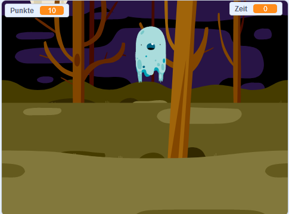

--- no-print ---

Dies ist die **Scratch 3** Version des Projekts. Es gibt auch eine [Scratch-2-Version des Projekts](https://projects.raspberrypi.org/de-DE/projects/ghostbusters-scratch2).

--- /no-print ---

## Einleitung

Du wirst ein Gespensterjagd-Spiel machen!

--- no-print ---

  <iframe allowtransparency="true" width="485" height="402" src="https://scratch.mit.edu/projects/embed/334694150/?autostart=false" frameborder="0" scrolling="no"></iframe>
  

--- /no-print ---

--- print-only ---

--- /print-only ---

--- collapse ---
---
title: Was du brauchen wirst
---

### Hardware

- Einen Computer

### Software

- Scratch 3 (entweder [online](https://rpf.io/scratchon){:target="_blank"} oder [offline](https://rpf.io/scratchoff){:target="_blank"})

--- /collapse ---

--- collapse ---
---
title: Was du lernen wirst
---

- Die Notwendigkeit von Pausen zwischen Aktionen innerhalb von Schleifen verstehen
- Code verwenden, um Zufallszahlen in Scratch zu generieren
- Eine Variable hinzufügen um einen Punktestand in Scratch zu speichern

--- /collapse ---

--- collapse ---
---
title: Zusätzliche Hinweise für Pädagogen
---

--- no-print ---

Wenn du dieses Projekt ausdrucken möchtest, verwende die [druckerfreundliche Version](https://projects.raspberrypi.org/de-DE/projects/ghostbusters/print){:target="_blank"}.

--- /no-print ---

Du findest das [abgeschlossene Projekt hier](https://rpf.io/p/de-DE/ghostbusters-get){:target="_blank"}.

--- /collapse ---