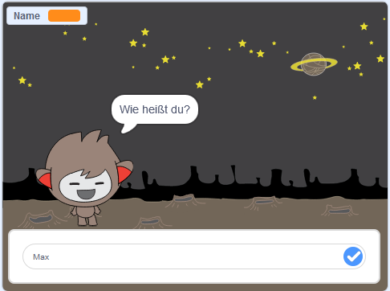

## Wie geht es weiter?

Herzlichen Glückwunsch, du hast das Geisterjäger-Projekt abgeschlossen! Möchtest du etwas herausfordernderes machen?

Schau dir das [Chatbot](https://projects.raspberrypi.org/de-DE/projects/chatbot?utm_source=pathway&utm_medium=whatnext&utm_campaign=projects) Projekt an.

--- no-print ---

Klicke auf die Grüne Flagge und danach auf das Chatbot-Männchen, um eine Unterhaltung zu beginnen. Wenn der Chatbot eine Frage stellt, trage deine Antwort in die Box am unteren Ende der Bühne ein und klicke auf den blauen Haken (oder drücke die `Enter` -Taste), um die Antwort des Chatbots zu sehen.

  <iframe allowtransparency="true" width="485" height="402" src="https://scratch.mit.edu/projects/embed/248864190/?autostart=false" 
  frameborder="0" scrolling="no"></iframe>

--- /no-print ---

--- print-only ---

--- /print-only ---

***

Dieses Projekt wurde von freiwilligen Helfern übersetzt:

Karl Schuh

Helmut Shlimper

Tassilo Scherrer

Thorsen Billib

Arnold Marko

Dank freiwilliger Helfer können wir Menschen auf der ganzen Welt die Möglichkeit geben, in ihrer eigenen Sprache zu lernen. Du kannst uns helfen, mehr Menschen zu erreichen, indem Du dich freiwillig zum Übersetzen meldest - weitere Informationen unter [rpf.io/translate](https://rpf.io/translate).