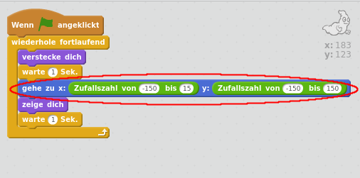

## Zufällige Gespenster

Dein Geist ist im Moment wirklich leicht zu fangen, weil er sich nicht bewegt!

\--- task \---

Kannst du deinem Geist Code hinzufügen, so dass er an zufälligen Positionen auf dem Bildschirm erscheint, anstatt an ein und derselben Stelle zu bleiben?

\--- hints \--- \--- hint \--- Bringe dein Gespenst dazu, vor jedem Erscheinen zu einer zufälligen Position `zu gehen`. \--- /hint \--- \--- hint \--- Es gibt zwei Sätze von Code-Blöcken, die du verwenden kannst. Diesen:  Oder diesen:  \--- /hint \--- \--- hint \--- Dein Code sollte entweder so aussehen:  Oder er könnte so aussehen:  \--- /hint \--- \--- /hints \---

\--- /task \---

\--- challenge \---

## Challenge: Mehr Zufälligkeit

Kannst du deinen Geist eine zufällige Zeit `warten` lassen, bevor er erscheint? Kannst du dem Gespenst mit dem `setzte Größe auf:`-Block vor jedem Erscheinen eine zufällige Größe geben? \--- /challenge \---