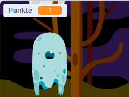

## Eine Punktzahl hinzufügen

Jetzt wirst du dein Spiel interessanter machen, indem du Punkte sammelst!

\--- task \---

Erstelle eine neue Variable namens `Punkte`{:class='block3variable'}.

[[[generic-scratch3-add-variable]]]

\--- /task \---

\--- task \---

Kannst du die Punktzahl des Spielers verfolgen? Die Spieler sollten Punkte bekommen, wenn sie auf Geister klicken und sie fangen.

Jedes Mal, wenn ein Spieler auf ein Gespenst klickt, sollte sein Punktestand erhöht werden.



\--- hints \--- \--- hint \---

`Wenn die grüne Flagge angeklickt wird`{:class=”block3events”}, sollte deine `Punkte`{:class=”block3variables”} Variable `auf 0 gesetzt`{:class=”block3variables”} werden. Am Besten fügst Du diesen Code der Bühne hinzu.

`Wenn die Geist-Figur angeklickt wird`{:class=”block3events”}, sollte sich der Wert der Variable `Punkte`{:class=”block3variables"} um `1 ändern`{:class=”block3variables"}.

\--- /hint \--- \--- hint \--- Hier sind die Codeblöcke die du brauchst: 

```blocks3
setze [Punkte v] auf (0)

Wenn die Flagge angeklickt wird
```


```blocks3
ändere [Punkte v] um (1)
```

\--- /hint \--- \--- hint \--- 

```blocks3
Wenn die Flagge angeklickt wird
setze [Punkte v] auf (0)
```


```blocks3
Wenn diese Figur angeklickt wird
verstecke dich

+ändere [Punkte v] um (1)
```

\--- /hint \--- \--- /hints \---

\--- /task \---