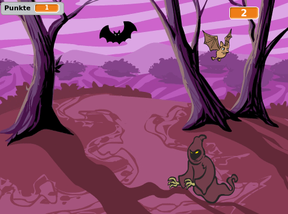

## Herausforderung: Mehr Figuren

Kannst du deinem Spiel andere Figuren hinzufügen?

Für jede Figur die du hinzufügen möchtest, musst du über einige Dinge nachdenken:

+ Wie groß soll die Figur sein?
+ Soll sie öfter oder weniger oft erscheinen als der Geist?
+ Wie sieht es aus/hört es sich an wenn sie Gefangen wird?
+ Wie viele Punkte erhält (oder verliert) der Spieler, wenn er sie fängt?

Falls du Hilfe brauchst, kannst du zurück zu den Anleitungen in den vorherigen Schritten gehen oder einen Freund fragen!