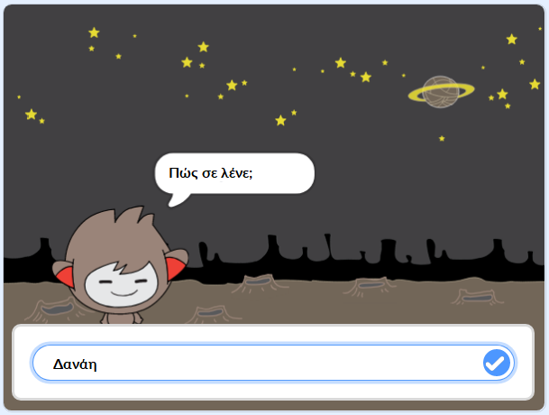

## Τι υπάρχει στη συνέχεια;

Συγχαρητήρια για την ολοκλήρωση του έργου "Κυνηγοί Φαντασμάτων"! Θα ήθελες να δημιουργήσεις κάτι λίγο πιο δύσκολο;

Δοκίμασε το έργο [Chatbot](https://projects.raspberrypi.org/el-GR/projects/chatbot?utm_source=pathway&utm_medium=whatnext&utm_campaign=projects).

--- no-print ---

Κάνε κλικ στην πράσινη σημαία και στη συνέχεια κλικ στο chatbot για να αρχίσει μία συζήτηση. Όταν το chatbot σε ρωτήσει, πληκτρολόγησε την απάντησή σου στο πλαίσιο στο κάτω μέρος του Σκηνικού και κάνε κλικ στο τικ (ή πάτησε `Enter`).

  <iframe allowtransparency="true" width="485" height="402" src="https://scratch.mit.edu/projects/embed/334706472/?autostart=false" 
  frameborder="0" scrolling="no"></iframe>

--- /no-print ---

--- print-only ---

--- /print-only ---

Το έργο αυτό μεταφράστηκε από τους εθελοντές:

Γιώργος Νικολαΐδης

Μάνος Ζεάκης

Δήμητρα Θεοδώρου

Κυριακή Ιντζεΐδου

Χάρη στους εθελοντές, μπορούμε να δώσουμε σε ανθρώπους σε όλο τον κόσμο την ευκαιρία να μάθουν στη γλώσσα τους. Μπορείτε να μας βοηθήσετε να προσεγγίσουμε περισσότερους ανθρώπους μεταφράζοντας εθελοντικά - περισσότερες πληροφορίες στο [rpf.io/translate](https://rpf.io/translate).