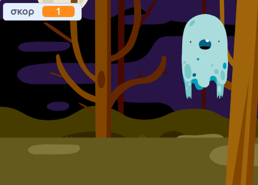

## Προσθήκη βαθμολογίας

Τώρα πρόκειται να κάνεις το παιχνίδι σου πιο ενδιαφέρον, διατηρώντας το σκορ!

--- task ---

task ---Δημιούργησε μία νέα μεταβλητή με όνομα `σκορ`{:class="block3variables"}.

[[[generic-scratch3-add-variable]]]

--- /task ---

--- task ---

Μπορείς να παρακολουθείς τη βαθμολογία του παίκτη; Οι παίκτες πρέπει να κερδίζουν πόντους όταν πιάνουν φαντάσματα κάνοντας κλικ πάνω τους.

Κάθε φορά που ένας παίκτης κάνει κλικ σε ένα φάντασμα, η βαθμολογία πρέπει να αυξάνεται.



--- hints ---
 --- hint ---

`Όταν πατηθεί η πράσινη σημαία`{:class="blockevents"}, η μεταβλητή σου `σκορ`{:class="blockdata"} πρέπει να `οριστεί σε 0`{:class="blockdata"}. Το Σκηνικό (Stage) είναι το καλύτερο μέρος για να προσθέσεις αυτόν τον κώδικα.

`Όταν πατηθεί η πράσινη σημαία`{:class="blockevents"}, η μεταβλητή σου `σκορ`{:class="blockdata"} πρέπει να `αλλάξει κατά 1`{:class="blockdata"}.

--- /hint --- --- hint --- Εδώ είναι τα μπλοκ που θα χρειαστείς:

```blocks3
όρισε [σκορ v] σε (0)

Όταν στην πράσινη σημαία γίνει κλικ
```


```blocks3
άλλαξε [σκορ v] κατά (1)
```

--- /hint --- --- hint --- 

```blocks3
Όταν στην πράσινη σημαία γίνει κλικ
όρισε [σκορ v] σε (0)
```


```blocks3
Όταν γίνει κλικ σε αυτό το αντικείμενο,
εξαφανίσου

+ άλλαξε [σκορ v] κατά (1)
```

--- /hint --- --- /hints ---

--- /task ---