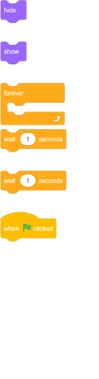
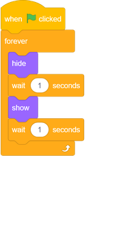

## Animate a ghost

--- task ---

Open a new empty Scratch project.

[[[generic-scratch3-new-project]]]

--- /task ---

--- task ---

Add in a new ghost sprite and a suitable Stage backdrop.

[[[generic-scratch3-sprite-from-library]]]

[[[generic-scratch3-backdrop-from-library]]]

--- /task ---

--- task ---

Add code to your ghost sprite so that the ghost appears and disappears forever when the green flag is clicked.

--- hints ---
--- hint ---

Once the `green flag is clicked`{:class="block3events"}, your ghost should `hide`{:class="block3looks"} for `one second`{:class="block3control"} and then `show`{:class="block3looks"} for `one second`{:class="block3control"}. It needs to do this `forever`{:class="block3control"}.
--- /hint ---
--- hint ---

Here are the code blocks you need:

--- /hint ---
--- hint ---
This is what your code should look like:

--- /hint ---
--- /hints ---

--- /task ---

--- task ---

Test and save your project.

[[[generic-scratch3-saving]]]

--- /task ---
