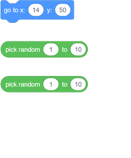
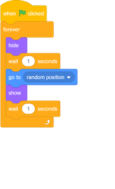
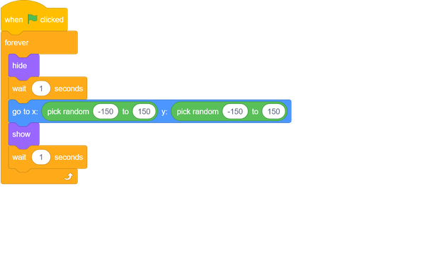

## Random ghosts

Your ghost is really easy to catch at the moment, because it doesn't move!

--- task ---

Can you add code to your ghost so that, instead of staying in the same position, the ghost appears at random positions on the Stage?

--- hints ---

--- hint ---

Each time before your ghost appears, it should `go to`{:class="block3motion"} a random position on the Stage.

--- /hint ---
--- hint ---

There are two sets of code blocks you could use here. Choose the set you prefer.

Either add this set of blocks to your ghost sprite:

Or add this one to your sprite:

--- /hint ---

--- hint ---

Your code could look either like this:

Or it could look like this:

--- /hint ---
--- /hints ---

--- /task ---
