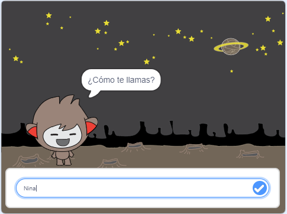

## ¿Qué hacer a continuación?

¡Enhorabuena por completar el proyecto Cazafantasmas! ¿Quieres crear algo un poco más desafiante?

Try out the [Chatbot](https://projects.raspberrypi.org/en/projects/chatbot?utm_source=pathway&utm_medium=whatnext&utm_campaign=projects) project.

\--- no-print \---

Haz clic en la bandera verde y después haz clic en el chatbot para iniciar una conversación. Cuando el chatbot haga una pregunta, escribe tu respuesta en el cuadro de la parte inferior del escenario y haz clic en la marca azul de la derecha (o presiona `Enter`) para ver la respuesta del chatbot.

  <iframe allowtransparency="true" width="485" height="402" src="https://scratch.mit.edu/projects/embed/248864190/?autostart=false" 
  frameborder="0" scrolling="no"></iframe>

\--- /no-print \---

\--- print-only \---

\--- /print-only \---