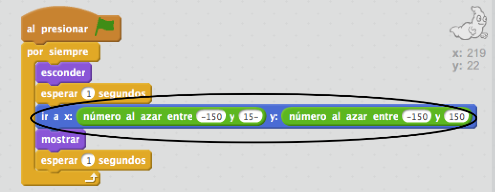

## Fantasmas aleatorios

¡Tu fantasma es muy fácil de atrapar en este momento, porque no se mueve!

\--- task \---

¿Puedes añadir código a tu fantasma para que, en vez de quedarse en el mismo sitio, aparezca en lugares aleatorios de la pantalla?

\--- hints \--- \--- hint \--- Quieres que tu fantasma `vaya` a una posición aleatoria del escenario antes de aparecer cada vez. \--- /hint \--- \--- hint \--- Puedes usar dos conjuntos de bloques de código. Este:  O este otro:  \--- /hint \--- \--- hint \--- Tu código debería quedar así:  O puede quedar así:  \--- /hint \--- \--- /hints \---

\--- /task \---

\--- challenge \---

## Desafío: más aleatoriedad

¿Puedes hacer que tu fantasma `espere` una cantidad aleatoria de tiempo antes de aparecer de nuevo? ¿Puedes utilizar el bloque `fijar tamaño` para hacer que tu fantasma tenga un tamaño aleatorio cada vez que aparezca? \--- /challenge \---