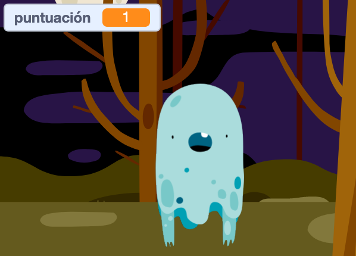

## Añadir una puntuación

¡Ahora vas a hacer tu juego más interesante manteniendo la puntuación!

--- task ---

Crea una nueva variable llamada `puntuación`{:class="blockdata"}.

[[[generic-scratch3-add-variable]]]

--- /task ---

--- task ---

¿Puedes hacer un seguimiento de la puntuación del jugador? Los jugadores deben ganar puntos cuando hacen clic en fantasmas para atraparlos.

Cada vez que un jugador hace clic en un fantasma, su puntuación debería aumentar.



--- hints ---
 --- hint ---

`Al hacer clic en la bandera verde`{:class="block3events"}, debes `dar a`{:class="block3variables"} tu variable `puntuación`{:class="block3variables"} el valor 0. El escenario es el mejor lugar para añadir este código.

`Al hacer clic en el objeto fantasma`{:class="block3events"}, debes `sumar 1`{:class="block3variables"} a la variable `puntuación`{:class="block3variables"}.

--- /hint --- --- hint --- Aquí están los bloques de código que necesitas: 

```blocks3
dar a [puntuación v] el valor (0)

al hacer clic en la bandera
```


```blocks3
cambiar [puntuación v] por (1)
```

--- /hint --- --- hint --- 

```blocks3
al hacer clic en la bandera
dar a [puntuación v] el valor (0)
```


```blocks3
Al hacer clic en este objeto
esconder

+ sumar a [puntuación v] (1)
```

--- /hint ------ /hints ---

--- /task ---