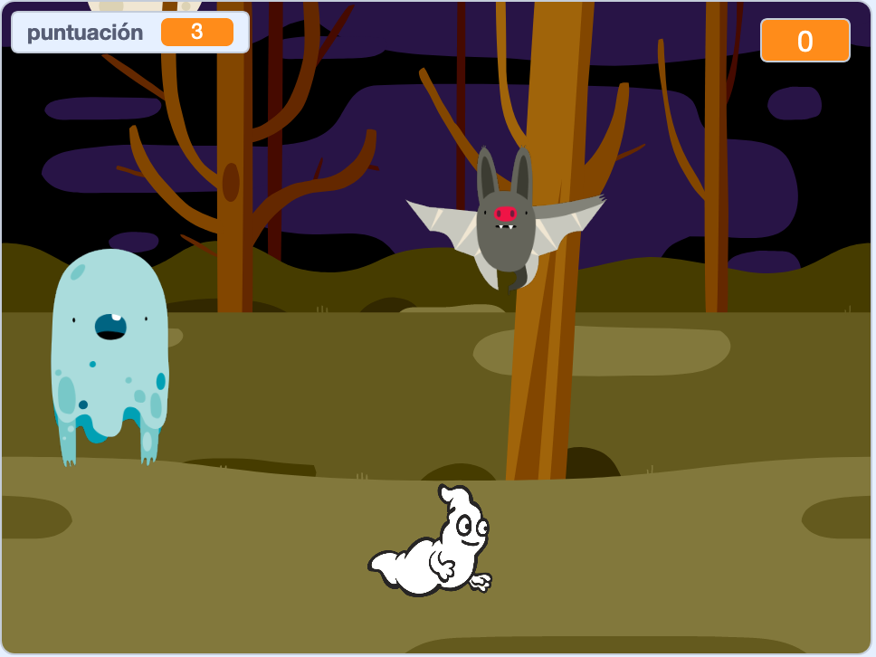

## Challenge

Improve your project with these challenges!

\--- task \---

If your game is too easy, you can:

+ Darle menos tiempo al jugador
+ Hacer que los fantasmas aparezcan con menos frecuencia
+ Hacer los fantasmas más pequeños

\--- /task \---

\--- task \---

¿Puedes añadir otros objetos a tu juego?

\--- collapse \---

* * *

title: Extra Sprites

* * *

Necesitas pensar en algunas cosas para cada objeto que quieras añadir:

+ ¿Cómo de grande debería ser el objeto?
+ ¿Debería aparecer con más o menos frecuencia que el objeto fantasma?
+ ¿Cómo se ve / suena cuando lo atrapan?
+ ¿Cuántos puntos gana (o pierde) el jugador por atraparlo?

Si necesitas ayuda, puedes volver a las instrucciones de los pasos anteriores, ¡o preguntar a un amigo!

\--- /collapse \---

\--- /task \---

\--- task \---

Can you add code to your ghost sprite to make the ghost `wait`{:class="block3control"} a random amount of time while it is hidden?

\--- /task \---

\--- task \---

Can you use the `set size`{:class="block3looks"} block to make your ghost a randomly larger or smaller each time it appears?

\--- /task \---

\--- task \---

Can you add code to your ghost so that the ghost makes a sound when it's caught?

\--- /task \---