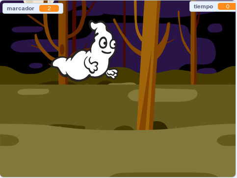

\--- no-print \---

Esta es la versión **Scratch 3** del proyecto. También existe una version [Scratch 2 del proyecto](https://projects.raspberrypi.org/en/projects/ghostbusters-scratch2).

\--- /no-print \---

## Introducción

¡Vas a hacer un juego de atrapar fantasmas!

\--- no imprimir \---

  <iframe allowtransparency="true" width="485" height="402" src="https://scratch.mit.edu/projects/embed/276874679/?autostart=false" frameborder="0" scrolling="no"></iframe>
  

\--- /no-print \---

\--- print-only \---

\--- /print-only \---

## \--- collapse \---

## title: Lo que necesitarás

### Hardware

- Un ordenador

### Software

- Scratch 3 (either [online](https://rpf.io/scratchon){:target="_blank"} or [offline](https://rpf.io/scratchoff){:target="_blank"})

\--- /collapse \---

## \--- collapse \---

## title: Lo que aprenderás

- Comprender la necesidad de pausas entre acciones dentro de bucles
- Usar código para generar números aleatorios en Scratch
- Añadir una variable para almacenar una puntuación de juego en Scratch

\--- /collapse \---

## \--- collapse \---

## title: Información adicional para educadores

\--- no-print \---

Si necesitas imprimir este proyecto, usa la [versión para imprimir](https://projects.raspberrypi.org/en/projects/ghostbusters/print){:target="_blank"}.

\--- /no-print \---

You can find the [completed project here](https://rpf.io/p/en/ghostbusters-get){:target="_blank"}.

\--- /collapse \---