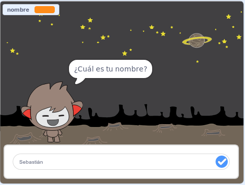

## ¿Qué sigue?

¡Bien hecho al completar el proyecto Cazafantasmas! ¿Quieres crear algo un poco más desafiante?

Prueba el proyecto [Chatbot](https://projects.raspberrypi.org/en/projects/chatbot?utm_source=pathway&utm_medium=whatnext&utm_campaign=projects).

\--- no-print \---

Haga clic en la bandera verde y luego haga clic en el personaje del chatbot para iniciar una conversación. Cuando el chatbot haga una pregunta, escriba su respuesta en el cuadro en la parte inferior del escenario y luego haga clic en la marca azul de la derecha (o presione ` Intro `) para ver la respuesta del chatbot.

  <iframe allowtransparency="true" width="485" height="402" src="https://scratch.mit.edu/projects/embed/248864190/?autostart=false" 
  frameborder="0" scrolling="no"></iframe>

\--- /no-print \---

\--- print-only \---

\--- /print-only \---