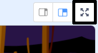

## Código para capturar fantasmas

Ahora vas a añadir código a tu juego para que el jugador pueda capturar fantasmas!

\--- task \---

¿Puedes hacer que tu fantasma desaparezca cuando haya sido capturado? El jugador debe poder hacer clic en fantasmas para capturarlos.

Si pruebas tu juego y encuentras que los fantasmas son difíciles de atrapar, puedes jugar el juego en modo pantalla completa haciendo clic en este botón:



\--- hints \--- \--- hint \---

`Al hacer clic en este objeto`{:class=”blockevents”}, tu fantasma se debería `esconder`{:class=”blocklooks"}.

\--- /hint \--- \--- hint \---

Your code should look like this:


```blocks3
al hacer clic en este objeto
esconder
```

\--- /hint \--- \--- /hints \---

\--- /task \---