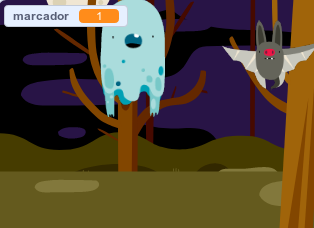

## Add a score

¡Ahora vas a hacer que tu juego sea más interesante añadiendo un sistema de puntuación!

\--- task \---

Crea una nueva variable llamada `puntaje` {: class = "block3variables"}.

[[[generic-scratch3-add-variable]]]

\--- /task \---

\--- /task \---

¿Puedes llevar la cuenta de la puntuación del jugador? Los jugadores deberían ganar puntos haciendo clic en los fantasmas para atraparlos.

Cada vez que un jugador hace clic en un fantasma, su puntuación debe aumentar.



\--- hints \--- \--- hint \---

`Al hacer clic en la bandera verde`{:class=”blockevents”}, debes dar a tu variable `puntaje`{:class=”blockdata”} `el valor 0`{:class=”blockdata"}. El escenario es el mejor lugar para añadir este código.

`Al hacer clic en el fantasma`{:class=”blockevents”}, deberías `sumar 1`{:class=”blockdata"} a la variable `puntaje`{:class=”blockdata”}.

\--- /hint \--- \--- hint \---

Here are the code blocks you need:


```blocks3
dar a [puntaje v] el valor (0)

al hacer clic en la bandera
```


```blocks3
sumar a [puntaje v] (1)
```

\--- /hint \--- \--- hint \---


```blocks3
al hacer clic en bandera verde
dar a [puntaje v] el valor (0)
```


```blocks3
Al hacer clic en este objeto
esconder

+ sumar a [puntaje v] (1)
```

\--- /hint \--- \--- /hints \---

\--- /task \---