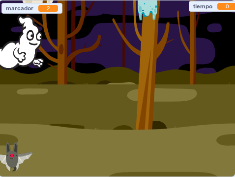

## Desafío: más sprites

¿Puedes añadir otros sprites a tu juego?

Debes pensar en algunas cosas para cada sprites que desee agregar:

+ ¿Qué tan grande debe ser el sprite?
+ ¿Aparecerá con más o menos frecuencia que el fantasma?
+ ¿Qué aspecto tendrá y qué sonido hará cuando lo atrapen?
+ ¿Cuántos puntos ganará (o perderá) el jugador por atraparlo?

Si necesitas ayuda, puede volver a las instrucciones de los pasos anteriores o preguntar a un amigo!