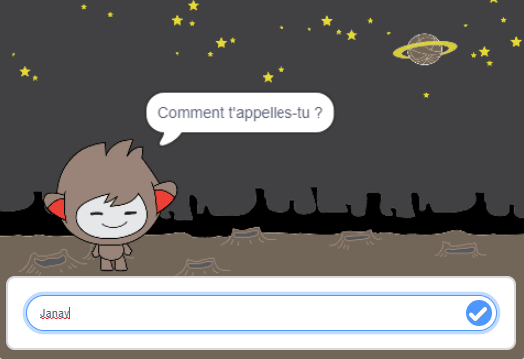

## Et ensuite?

Bravo pour avoir terminé le projet Ghostbusters! Veux-tu créer quelque chose d'un peu plus difficile?

Essaye le projet [Chatbot](https://projects.raspberrypi.org/fr-FR/projects/chatbot?utm_source=pathway&utm_medium=whatnext&utm_campaign=projects).

--- no-print ---

Clique sur le drapeau vert, puis sur le personnage du chatbot pour lancer une conversation. Lorsque le chatbot pose une question, tape ta réponse dans la zone située au bas de la scène, puis clique sur la marque bleue à droite (ou appuie sur `Entrée`) pour voir la réponse du chatbot.

  <iframe allowtransparency="true" width="485" height="402" src="https://scratch.mit.edu/projects/embed/334705661/?autostart=false" 
  frameborder="0" scrolling="no"></iframe>

--- /no-print ---

--- print-only ---

--- /print-only ---

***

Ce projet a été traduit par des bénévoles:

Josie Hough

David Debaire

Jonathan Vannieuwkerke

Sarah-jane Hubbard

Mohamed Ali Chelbi

Simon Gleises

Grâce aux bénévoles, nous pouvons donner aux gens du monde entier la chance d'apprendre dans leur propre langue. Vous pouvez nous aider à atteindre plus de personnes en vous portant volontaire pour la traduction - plus d'informations sur [rpf.io/translate](https://rpf.io/translate).