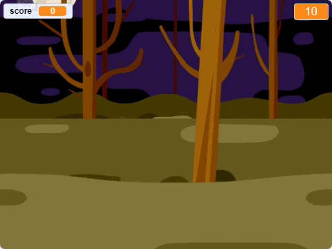

## परिचय

आप एक भूत-पकड़ने वाला गेम बनाने जा रहे हैं!

### आप क्या बनाएँगे

\--- no-print \---

\--- /no-print \---

\--- print-only \---

\--- /print-only \---

\--- collapse \---

* * *

## title: आपको किन चीजों की आवश्यकता होगी

### हार्डवेयर

+ एक कंप्यूटर

### सॉफ्टवेयर

+ Scratch 2.0 (या तो [ऑनलाइन](http://rpf.io/scratchon){:target="_blank"} या [ऑफलाइन](http://rpf.io/scratchoff){:target="_blank"})

\--- /collapse \---

\--- collapse \---

* * *

## title: आप क्या सीखेंगे

यह प्रोजेक्ट [Raspberry Pi डिजिटल निर्माण पाठ्यक्रम](http://rpf.io/curriculum) के निम्नलिखित तत्वों को पूरा करता है{:target="_blank"}:

+ [सरल प्रोग्राम बनाने के लिए आधारभूत संरचनाओं का उपयोग करें।](https://www.raspberrypi.org/curriculum/programming/creator)

\--- /collapse \---

\--- no-print \---

यदि आप इस प्रोजेक्ट को प्रिंट करना चाहते हैं, तो कृपया [प्रिंटर अनुकूल संस्करण](https://projects.raspberrypi.org/en/projects/ghostbusters/print) का उपयोग करें।

\--- /no-print \---