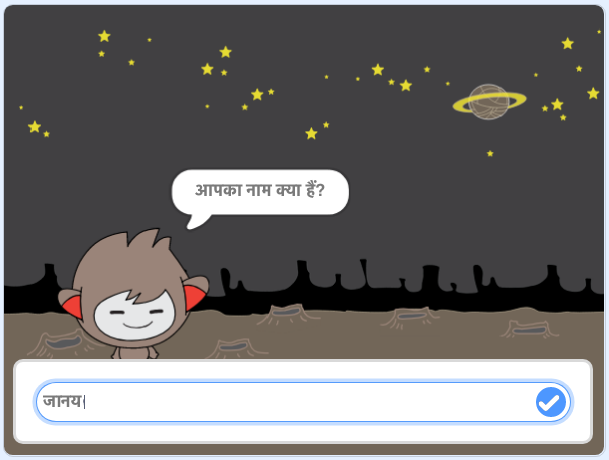

## आगे क्या?

बधाई हो! परियोजना पूर्ण! कोई और परियोजना खोजें?

आप [चैटबॉट](https://projects.raspberrypi.org/en/projects/chatbot?utm_source=pathway&utm_medium=whatnext&utm_campaign=projects) प्रोजेक्ट को देख सकते हैं।

\--- no-print \---

हरे झंडे पर क्लिक करे, और फिट चैटबॉट पर क्लिक करे बातचीत शुरू करने के लिए। जब चैटबॉट आपसे कुछ पूछे, तब अपनी जवाब स्टेज के निचे डिब्बे में लिख दीजिये, और फिर नीले निशान (नहीं तो `एंटर` प्रेस कीजिये) पर क्लिक करे ताकि आप अपनी चैटबॉट का जवाब देख सकते हैं।

  <iframe allowtransparency="true" width="485" height="402" src="https://scratch.mit.edu/projects/embed/248864190/?autostart=false" 
  frameborder="0" scrolling="no"></iframe>

\--- /no-print \---

\--- print-only \---

\--- /print-only \---