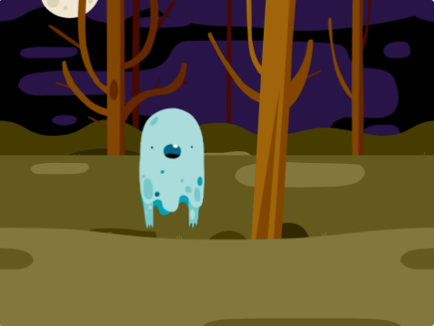

## भूत का एनिमेशन बनाना

--- task ---

एक नया खाली Scratch प्रोजेक्ट खोलें।

[[[generic-scratch3-new-project]]]

--- /task ---

--- task ---

आपके स्टेज पर मिलती हुई एक भूत स्प्राइट जोड़े।



[[[generic-scratch3-sprite-from-library]]]

[[[generic-scratch3-backdrop-from-library]]]

--- /task ---

--- task ---

आपके भूत स्प्राइट में ऐसी कोड जोड़िये ताकि आपका भूत हमेशा के लिए झपकता हैं जब आप हरे झंडे पर क्लिक करे।

--- hints ---
 --- hint ---

जब आप हरे झंडे पर क्लिक करेंगे `green flag is clicked`{:class="block3events"}, तब आपका भूत `one second`{:class="block3control"} के लिए `hide`{:class="block3looks"} होना चाहिए और फिर `one second`{:class="block3control"} के लिए `show`{:class="block3looks"} होना चाहिए। इसको यह कार्य `forever`{:class="block3control"} के लिए करना हैं।

--- /hint --- --- hint ---

आपको इस कोड ब्लॉक की ज़रुरत पड़ेगी:


```blocks3
hide

show

forever
end

wait (1) seconds

wait (1) seconds

when flag clicked
```

--- /hint --- --- hint ---

आपका कोड ऐसा दिखना चाहिए:


```blocks3
when flag clicked
forever
hide
wait (1) seconds
show
wait (1) seconds
end
```

--- /hint ------ /hints ---

--- /task ---

--- task ---

प्रोजेक्ट का परीक्षण करें और सहेजें

[[[generic-scratch3-saving]]]

--- /task ---