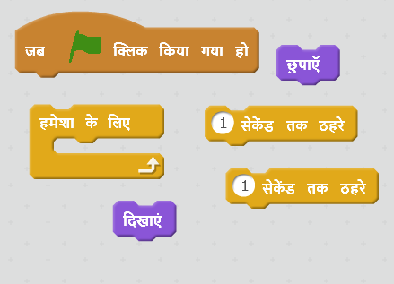
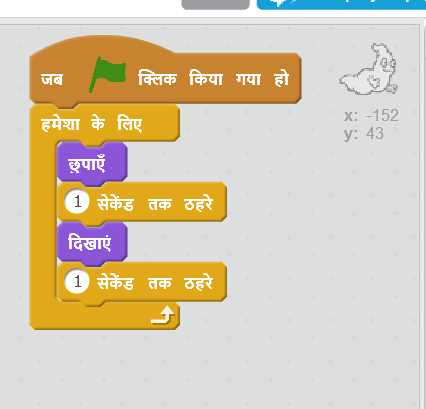

## भूत का एनिमेशन बनाना

\--- task \---

एक नया खाली स्क्रैच प्रोजेक्ट खोलें।

[[[generic-scratch-new-project]]]

\--- /task \---

\--- task \---

एक नया भूत स्प्राइट और एक उपयुक्त पृष्ठभूमि(backdrop) स्टेज में जोड़ें।

[[[generic-scratch-sprite-from-library]]]

[[[generic-scratch-backdrop-from-library]]]

\--- /task \---

\--- task \---

अपने भूत में कोड जोड़ें ताकि जब आप झंडे पर क्लिक करें तो यह हमेशा प्रकट और गायब होता रहे।

\--- hints \--- \--- hint \--- जब `हरा झंडा क्लिक किया जाए` {: class = "blockevents"}, तो आपको अपने भूत को `​​छिपाने की आवश्यकता होगी` {: वर्ग = "blocklooks"} `एक सेकंड के लिए` {: class = "blockcontrol"} और फिर `दिखाना` {: वर्ग = "blocklooks"} होगा `एक सेकंड के लिए` {: वर्ग = "blockcontrol"}। इसे ऐसा `हमेशा` के लिए करना होगा।{:class=”blockcontrol”} \--- /hint \--- \--- hint \--- ये वे कोड ब्लॉक हैं, जिनकी आपको आवश्यकता होगी:  \--- /hint \--- \--- hint \--- आपका कोड इस प्रकार दखाई देगा:  \--- /hint \--- \--- /hints \---

\--- /task \---

\--- task \---

प्रोजेक्ट का परीक्षण करें और सहेजें

[[[generic-scratch-saving]]]

\--- /task \---