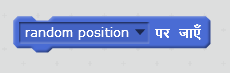
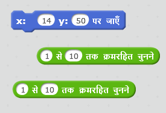
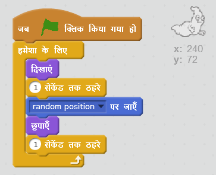
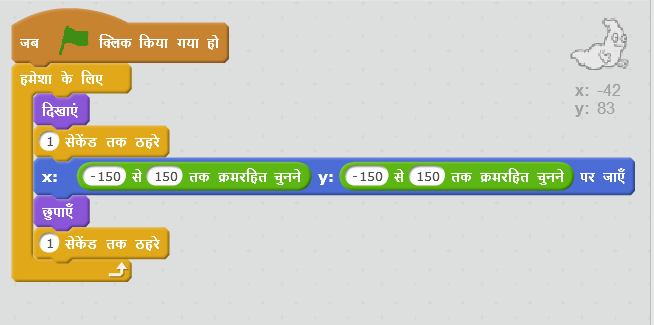

## अस्थाई भूत

आपका भूत इस समय पकड़ने में वाकई आसान है, क्योंकि यह चलता नहीं है!

\--- task \---

क्या आप अपने भूत में कोड जोड़ सकते हैं, ताकि एक ही स्थिति में रहने के बजाय, यह स्क्रीन पर अस्थाई दिखाई दे?

\--- hints \--- \--- hint \--- आप चाहते हैं कि आपका भूत हर बार स्टेज पर दिखने से पहले अस्थाई स्थिति पर चला `जाए`। \--- /hint \--- \--- hint \--- आप दो प्रकार के कोड ब्लॉक्स का उपयोग कर सकते हैं। यह वाला:  या यह वाला:  \--- /hint \--- \--- hint \--- आपका कोड या इस तरह दिखना चाहिए::  या यह इस तरह दिख सकता है:  \--- /hint \--- \--- /hints \---

\--- /task \---

\--- challenge \---

## चुनौती: अधिक अस्थाई

क्या आप ऐसा कर सकते हैं कि आपका भूत दिखाई देने से पहले अस्थाई समय तक `ठहरे`? क्या आप हर बार नए आकार का भूत बनाने के लिए `आकार सेट करें` ब्लॉक का उपयोग कर सकते हैं? \--- /challenge \---