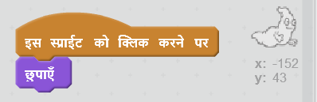

## भूत पकड़ना

चलिए अपने खिलाड़ी को भूत पकड़ने की अनुमति दें!

\--- task \---

क्या आप ऐसा कर सकते हैं कि पकड़े जाने पर भूत गायब हो जाए?

आप भूत पर क्लिक करके ही उन्हें पकड़ पाएंगे। यदि आपको पकड़ना मुश्किल लगे, तो आप इस बटन पर क्लिक करके गेम को फुल स्क्रीन मोड में खेल सकते हैं:

\--- hints \--- \--- hint \--- `क्लिक होने पर`, आपके भूत स्प्राइट को `छुप`जाना चाहिए। \--- /hint \--- \--- hint \--- आपका कोड इस तरह दिखना चाहिए:  \--- /hint \--- \--- /hints \---

\--- /task \---

\--- challenge \---

## चुनौती: ध्वनि जोड़ना

क्या आप ऐसा कर सकते हैं कि भूत के पकड़े जाने पर यह आवाज़ उत्पन्न करे? \--- /challenge \---