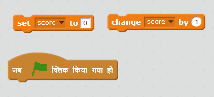
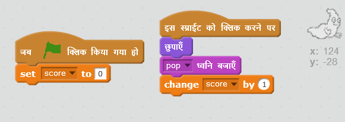

## स्कोर जोड़ना

चलो स्कोर जोड़ कर चीजों को और अधिक रोचक बनाएं!

\--- task \---

'score' नामक एक नया वेरिएबल बनाएँ।

[[[generic-scratch-add-variable]]]

\--- /task \---

\--- task \---

क्या आप खिलाड़ी के स्कोर पर नज़र रख सकते हैं? स्कोर बनाने के लिए खिलाड़ी को भूत पर क्लिक करना होगा।

हर बार खिलाड़ी भूत पर क्लिक करें, तो उनके स्कोर बढ़ने चाहिए।

\--- hints \--- \--- hint \--- `जब हरा झंडा क्लिक किया जाए` </code>{:class=”blockevents”}, तो आपका `score` {: class = "blockdata"} वेरिएबल `0 पर सेट हो जाना चाहिए</0>{:class=”blockdata”}। इस कोड को जोड़ने के लिए स्टेज सबसे बढ़िया स्थान है। <code>जब भूत स्प्राइट क्लिक किया जाए` {:class=”blockevents”}, `स्कोर` {: class = "blockdata"} `1 से बदल जाना चाहिए` {: वर्ग = "blockdata"}। \--- /hint \--- \--- hint \--- ये वे कोड ब्लॉक हैं, जिनकी आपको आवश्यकता होगी:  \--- /hint \--- \--- hint \--- यहाँ भूत पर क्लिक करके अंक स्कोर बनाने का तरीका बताया गया है:  \--- /hint \--- \--- /hints \---

\--- /task \---