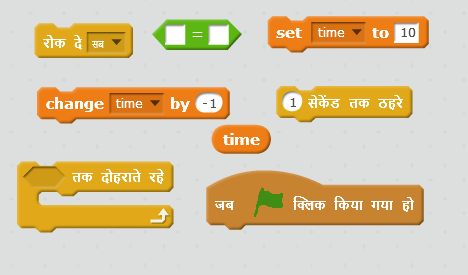
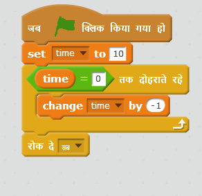
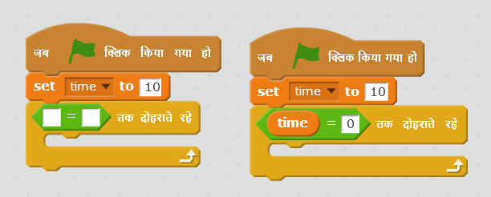

## टाइमर(timer) जोड़ना

\--- task \---

'time' नामक एक नया वेरिएबल बनाएँ।

\--- /task \---

\--- task \---

अपने खिलाड़ी को भूत पकड़ने के लिए अधिकतम 10 सेकंड का समय देने के लिए क्या आप अपने स्टेज में टाइमर जोड़ सकते हैं?

आपके टाइमर को चाहिए कि:

+ 10 सेकंड से शुरू करें
+ हर सेकंड को गिने

जब टाइमर 0 हो जाए तो गेम को रुकना चाहिए।

\--- hints \--- \--- hint \--- `जब हरा झंडा क्लिक किया जाए`{:class=”blockevents”}, तो आपका `time` {: class = "blockdata"} वेरिएबल `10 पर सेट हो जाना चाहिए`{:class=”blockdata”}। इसके बाद इसे`-1 से बदलना चाहिए` {: class = "blockdata"} प्रत्येक सेकेंड `जब तक कि यह 0 तक नहीं पहुँच जाता` {:class=”blockcontrol"}। \--- /hint \--- \--- hint \--- ये वे कोड ब्लॉक हैं, जिनकी आपको आवश्यकता होगी:  \--- /hint \--- \--- hint \--- यहाँ अपने गेम में टाइमर जोड़ने का तरीका बताया गया है: 

और यह `time = 0` ब्लॉक बनाने का तरीका है:  \--- /hint \--- \--- /hints \---

\--- /task \---

\--- task \---

किसी मित्र से अपने गेम का परीक्षण करने के लिए कहें। वे कितने अंक(points) स्कोर कर सकते हैं?

\--- /task \---

यदि आपका गेम बहुत आसान है, तो आप यह कर सकते हैं:

+ खिलाड़ी को कम समय दें सकते है
+ भूत को कम बार प्रकट कर सकते है
+ भूत को छोटा बना सकते है

\--- task \---

गेम में तब तक परिवर्तन करें और परीक्षण करें जब तक आप इसकी कठिनता के स्तर से ख़ुश न हो जाएँ।

\--- /task \---