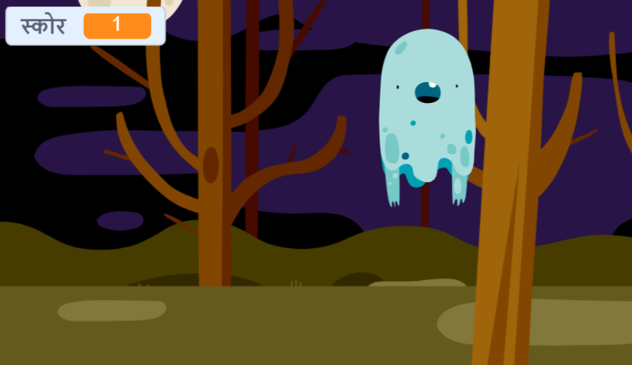

## स्कोर जोड़ें

अब आप स्कोर रखकर अपने खेल को और दिलचस्प बनाने जा रहे हैं!

\--- task \---

`score`{:class="block3variables"} नामक एक नया वेरिएबल बनाएं।

[[[generic-scratch3-add-variable]]]

\--- /task \---

\--- task \---

क्या आप खिलाड़ी के स्कोर का ध्यान रख सकते हैं? स्कोर बनाने के खिलाड़ी को भूत पकड़ने के लिए उन पर क्लिक करना होगा।

हर बार जब खिलाड़ी भूत पर क्लिक करता है, तो उसका स्कोर बढ़ना चाहिए।



\--- hints \--- \--- hint \---

जब हरा झंडा क्लिक किया गया हो `When the green flag is clicked`{:class="block3events"}, तो आपका `score`{:class="block3variables} वेरिएबल `set to 0`{:class="block3variables"} होना चाहिए। इस कोड को जोड़ने के लिए स्टेज सबसे अच्छी जगह है।

भूत स्प्राईट को क्लिक करने पर `When the ghost sprite is clicked`{:class="block3events"}, तो `score`{:class="block3variables"} वेरियबल को `changed by 1`{:class="block3variables"} हो जाना चाहिए।

\--- /hint \--- \--- hint \---

आपको इन कोड ब्लॉक्स की ज़रुरत पड़ेगी:


```blocks3
set [score v] to (0)

when flag clicked
```


```blocks3
change [score v] by (1)
```

\--- /hint \--- \--- hint \---


```blocks3
when flag clicked
set [score v] to (0)
```


```blocks3
When this sprite clicked
hide

+ change [score v] by (1)
```

\--- /hint \--- \--- /hints \---

\--- /task \---