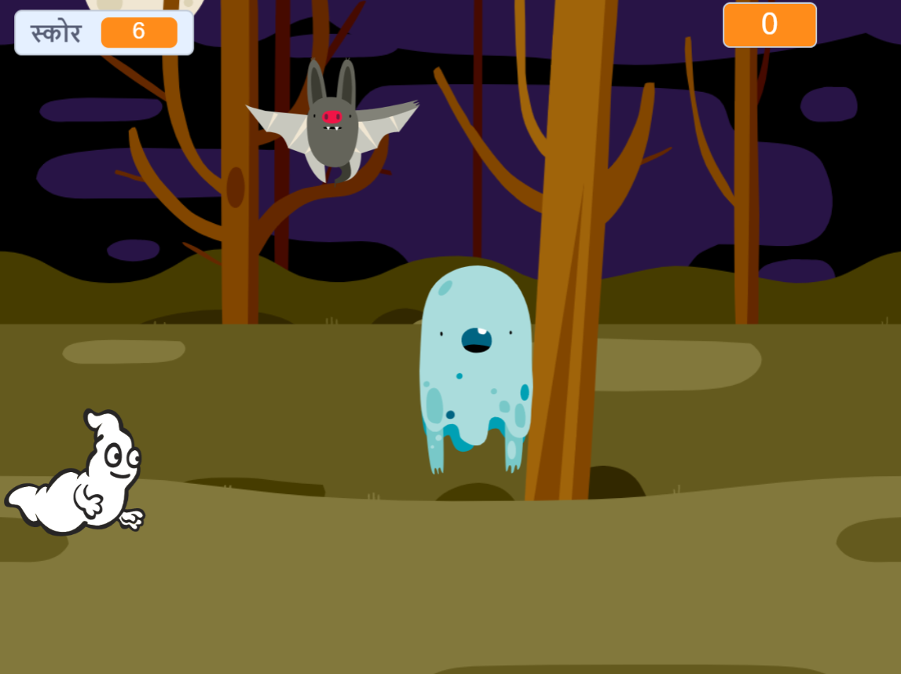

## चुनौती: और स्प्रिट्स

क्या आप अपनी गेम में अन्य स्प्रिट्स जोड़ सकते हैं?

जब आप स्प्रिट्स जोड़ते हैं, तो आपको निम्नलिखित बातों पर ध्यान देना होगा।

+ यह कितना बड़ा होना चाहिए?
+ क्या यह भूत से कम या अधिक बार दिखाई देगा?
+ पकड़े जाने पर यह कैसा दिखाई देगा/कैसी आवाज़ करेगा?
+ इसे पकड़ने पर खिलाड़ी को कितने अंक मिलेंगे (या कम होंगे)?

यदि अन्य स्प्रिट्स को जोड़ने में आपको सहायता की आवश्यकता हो, तो आप उपर्युक्त चरणों का पुनः उपयोग कर सकते हैं!