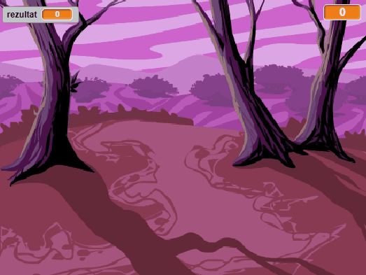

## Uvod

Napravit ćeš igru o hvatanju duhova!

### Napravit ćeš

--- no-print ---

--- /no-print ---

--- print-only ---

--- /print-only ---

--- collapse ---
---
title: Trebat ćeš
---
### Hardver

+ Računalo

### Softver

+ Scratch 2.0 ([online](https://rpf.io/scratchon){:target="_blank"} ili [offline](https://rpf.io/scratchoff){:target="_blank"} verziju)

--- /collapse ---

--- collapse ---
---
title: Naučit ćeš
---
Ovaj projekt obuhvaća elemente iz sljedećih dijelova [Raspberry Pi Digital Making Curriculum](https://rpf.io/curriculum){:target="_blank"} nastavnog plana i programa:

+ [Korištenje osnova programiranja za izradu jednostavnih programa.](https://www.raspberrypi.org/curriculum/programming/creator)

--- /collapse ---

--- no-print ---

Ako trebate ispisati ovaj projekt, koristite [verziju koja je prilagođena pisaču](https://projects.raspberrypi.org/en/projects/ghostbusters/print).

--- /no-print ---
