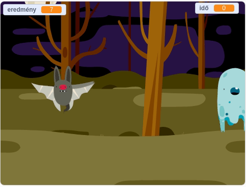

--- no-print ---

Ez a projekt **Scratch 3** -as verziója. Elérhető [Scratch 2-es](https://projects.raspberrypi.org/hu-HU/projects/ghostbusters-scratch2) változatban is.

--- /no-print ---

## Bevezetés

Készíts szellemfogó játékot!

--- no-print ---

  <iframe allowtransparency="true" width="485" height="402" src="https://scratch.mit.edu/projects/embed/276874679/?autostart=false" frameborder="0" scrolling="no"></iframe>
  

--- /no-print ---

--- print-only ---

--- /print-only ---

--- collapse ---
---
title: Mire lesz szükséged
---

### Hardver

- Egy számítógép

### Szoftver

- Scratch 3 (vagy [online](http://rpf.io/scratchon){:target="_blank"} vagy [offline](http://rpf.io/scratchoff){:target="_blank"})

--- /collapse ---

--- collapse ---
---
title: Mit fogsz megtanulni
---

- megérted hogyan használj szüneteket a műveleti ciklusokon belül
- a véletlen számok használatát a Scratch-ban
- hogyan használj változót a játék pontszámának tárolásához a Scratch-ban

--- /collapse ---

--- collapse ---
---
title: További információk oktatóknak
---

--- no-print ---

Ha ki szeretnéd nyomtatni a projektet, kérlek használd a [nyomtatóbarát verziót.](https://projects.raspberrypi.org/hu-HU/projects/ghostbusters/print){:target="_blank"}.

--- /no-print ---

Itt található a [befejezett projekt](http://rpf.io/p/hu-HU/ghostbusters-get){:target="_blank"}.

--- /collapse ---