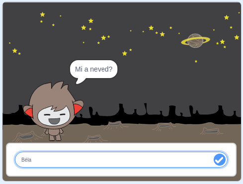

## Mi a következő lépés?

Sikerült befejezned a Szellemirtós projektet! Szeretnél készíteni valamit, ami kicsit nehezebb?

Próbáld ki a [Chatbot](https://projects.raspberrypi.org/en/projects/chatbot?utm_source=pathway&utm_medium=whatnext&utm_campaign=projects) projektet.

\--- no-print \---

Kattints a zöld zászlóra, majd a chatbot karakterre a beszélgetés megkezdéséhez. Amikor a chatbot feltesz egy kérdést, írd be a választ a játéktér alján található mezőbe, és kattints a jobb oldali kék jelre (vagy nyomd meg a `Enter`-t) a chatbot válaszának megtekintéséhez.

  <iframe allowtransparency="true" width="485" height="402" src="https://scratch.mit.edu/projects/embed/248864190/?autostart=false" 
  frameborder="0" scrolling="no"></iframe>

\--- /no-print \---

\--- print-only \---

\--- /print-only \---