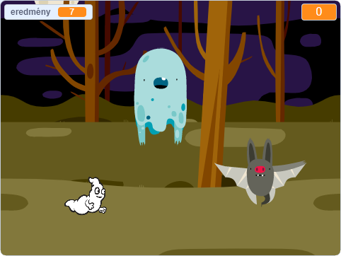

## Challenge

Improve your project with these challenges!

\--- task \---

If your game is too easy, you can:

+ adj kevesebb időt a játékosnak
+ ritkábban jelenjenek meg a szellemek
+ legyenek kisebbek a szellemek

\--- /task \---

\--- task \---

Tudnál más szereplőket hozzáadni a játékodhoz?

\--- collapse \---

* * *

title: Extra Sprites

* * *

Gondold át a következőket minden új szereplő esetén:

+ Milyen nagy legyen a szereplő?
+ Ritkábban vagy gyakrabban jelenjen meg, mint a szellem szereplő?
+ Hogy nézzen ki/milyen hangja legyen, amikor elkapják?
+ Mennyi pontot kapjon (vagy veszítsen) a játékos a szereplő elkapásákor?

Ha segítségre van szükséged, akkor térj vissza a korábbi lépésekben található utasításokhoz, vagy kérdezd meg egy barátodat!

\--- /collapse \---

\--- /task \---

\--- task \---

Can you add code to your ghost sprite to make the ghost `wait`{:class="block3control"} a random amount of time while it is hidden?

\--- /task \---

\--- task \---

Can you use the `set size`{:class="block3looks"} block to make your ghost a randomly larger or smaller each time it appears?

\--- /task \---

\--- task \---

Can you add code to your ghost so that the ghost makes a sound when it's caught?

\--- /task \---