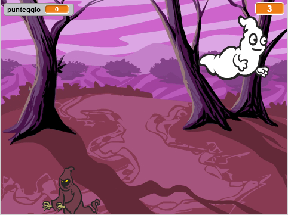

--- no-print ---

Questa è la versione **Scratch 3** del progetto. C'è anche una [versione Scratch 2 del progetto](https://projects.raspberrypi.org/it-IT/projects/ghostbusters-scratch2).

--- /no-print ---

## Introduzione

Stai per creare un gioco di acchiappa-fantasmi!

--- no-print ---

  <iframe allowtransparency="true" width="485" height="402" src="https://scratch.mit.edu/projects/embed/334699971/?autostart=false" frameborder="0" scrolling="no"></iframe>
  

--- /no-print ---

--- print-only ---

--- /print-only ---

--- collapse ---
---
title: Di cosa avrai bisogno
---

### Hardware

- Un computer

### Software

- Scratch 3 ([online](https://rpf.io/scratchon){:target="_blank"} o [offline](https://rpf.io/scratchoff){:target="_blank"}"})

--- /collapse ---

--- collapse ---
---
 title: Cosa imparerai
---

- Comprendere la necessità di una pausa tra le azioni all'interno dei cicli
- Usa il codice per generare numeri casuali in Scratch
- Aggiungi una variabile per memorizzare un punteggio di gioco in Scratch

--- /collapse ---

--- collapse ---
---
title: Note addizionali per gli educatori
---

--- no-print ---

Se intendete stampare questo progetto, cliccate su [Versione stampabile](https://projects.raspberrypi.org/it-IT/projects/ghostbusters/print){:target="_blank"}.

--- /no-print ---

Puoi trovare il [progetto completo qui](https://rpf.io/p/it-IT/ghostbusters-get){:target="_blank"}.

--- /collapse ---