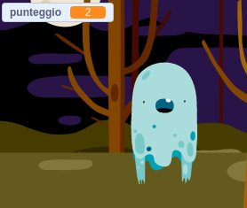

## Aggiungere un punteggio

Ora renderai il tuo gioco più interessante aggiungendo il punteggio!

\--- task \---

Crea una nuova variabile chiamata `punteggio`{:class="block3variables"}.

[[[generic-scratch3-add-variable]]]

\--- /task \---

\--- task \---

Can you keep track of the player's score? Players should score points when they click on ghosts to catch them.

Ogni volta che un giocatore fa click su un fantasma, il punteggio dovrebbe aumentare.



\--- hints \--- \--- hint \---

`When the green flag is clicked`{:class="block3events"}, your `score`{:class="block3variables"} variable should be `set to 0`{:class="block3variables"}. Lo sfondo è il posto più adatto dove inserire questo codice.

`When the ghost sprite is clicked`{:class="block3events"}, the `score`{:class="block3variables"} variable should be `changed by 1`{:class="block3variables"}.

\--- /hint \--- \--- hint \--- Here are the code blocks you need: 

```blocks3
set [score v] to (0)

when flag clicked
```


```blocks3
cambia [punteggio v] di (1)
```

\--- /hint \--- \--- hint \--- 

```blocks3
when flag clicked
set [score v] to (0)
```


```blocks3
When this sprite clicked
hide

+ change [score v] by (1)
```

\--- /hint \--- \--- /hints \---

\--- /task \---